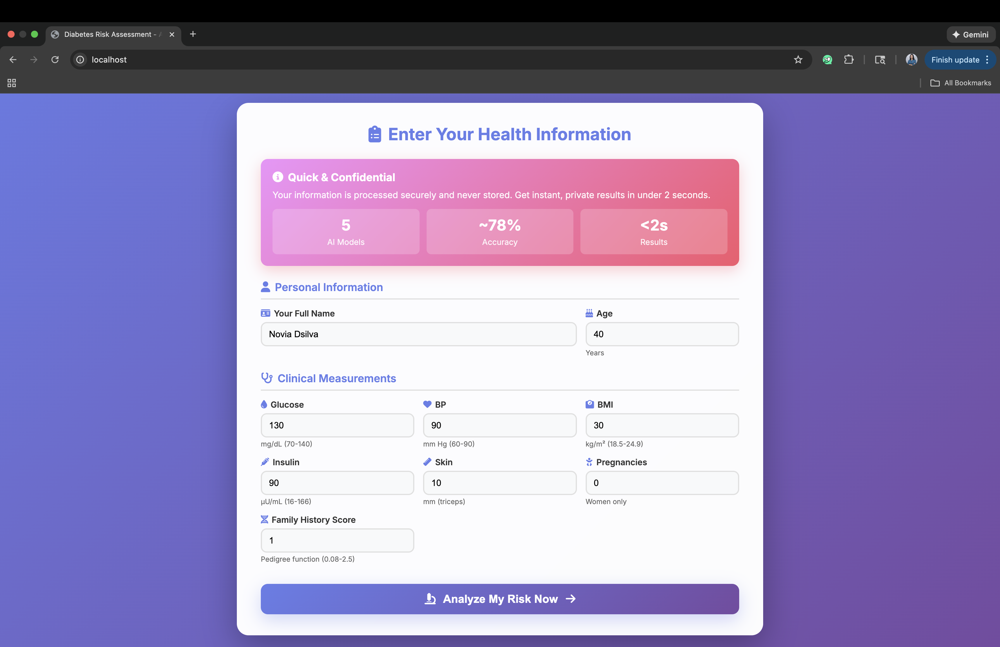
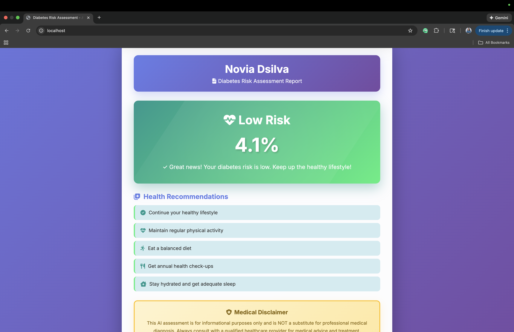
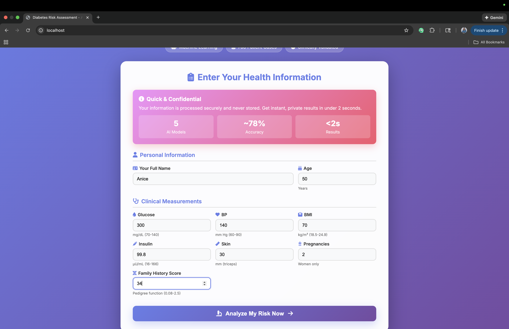

# MLOPS-ASSIGNMENT6-DOCKER-LAB2

### Diabetes Risk Prediction System 

**Student:** Novia Dsilva 

---

## Assignment Overview

This project transforms the original Iris flower classifier into an advanced diabetes risk prediction system using multiple machine learning models and Docker containerization.

### Key Features

- 5 Machine Learning Models (Neural Network, Random Forest, Gradient Boosting, SVM, Logistic Regression)
- Automatic best model selection (Random Forest: 77.92% accuracy)
- Professional medical-grade web interface
- Real-time predictions (< 2 seconds)
- Personalized health recommendations
- Docker multi-stage build optimization

---

## Major Modifications from Original Iris Classifier

| Aspect | Original Iris | Our Diabetes System |
|--------|---------------|---------------------|
| **ML Models** | 1 (Neural Network) | 5 (Auto-selected best) |
| **Domain** | Flower classification | Medical diagnosis |
| **Features** | 4 measurements | 8 clinical features |
| **Output** | Class name | Risk % + recommendations |
| **Preprocessing** | Basic normalization | StandardScaler + validation |
| **UI** | Simple form | Professional interface |
| **Docker** | Single stage | Multi-stage build |
| **Code** | Monolithic | Modular architecture |
| **Medical Context** | None | Clinical ranges + disclaimer |
| **Personalization** | Generic | Patient-specific advice |

**Total Enhancements:** 30+ modifications across ML, UI, architecture, and production features

---

## System Screenshots

### 1. Docker Build & Container Startup


### 2. Docker Images List


### 3. Application Landing Page

*Professional interface with ML badges*

### 4. Input Form - Test Case 1

*Patient: Novia Dsilva, Age 40, Moderate risk profile*

### 5. Result - Low Risk

*4.1% risk with health recommendations*

### 6. Input Form - Test Case 2

*Patient: Anice, Age 50, High risk profile*

### 7. Result with Risk Factors

*55.2% risk with identified risk factors*

---

## Quick Start Guide

### Prerequisites
- Docker installed
- 4GB RAM minimum

### Build and Run
```bash
# Build the image
docker build -t diabetes-prediction .

# Run the container
docker run -p 80:4000 diabetes-prediction

# Access application
# http://localhost/
```

### Alternative Port
```bash
docker run -p 8080:4000 diabetes-prediction
# Access: http://localhost:8080/
```

---

## Project Structure
```
Lab2/
├── src/
│   ├── model_training.py       # Trains 5 models, selects best
│   ├── main.py                 # Flask API
│   ├── sreenshots                  
│   └── templates/
│       └── predict.html         # Web interface
├── dockerfile                   # Multi-stage build
├── requirements.txt             # Dependencies
└── README.md
```

**Generated during build:**
- `best_model.keras/.pkl` - Best performing model
- `scaler.pkl` - Feature scaler
- `model_info.json` - Model metadata

---

## Model Performance

| Model | Accuracy | Status |
|-------|----------|--------|
| **Random Forest** | **77.92%** | **Selected** |
| Gradient Boosting | 76.62% | - |
| Neural Network | 75.32% | - |
| Logistic Regression | 75.32% | - |
| SVM | 74.68% | - |

---

# Docker Tutorial

## Getting Started

To start using Docker, you'll need to:

1. **Install Docker:** Download and install Docker for your specific platform from [Docker's official website](https://www.docker.com/get-started).

2. **Run Your First Container:** Pull an existing image from Docker Hub and run it in a container using the `docker run` command.

3. **Create Docker Images:** Write a Dockerfile to define your application's image, build it, and run containers based on that image.

4. **Use Docker Compose:** Define multi-container applications and their dependencies in a `docker-compose.yml` file, then use `docker-compose` to manage the entire application stack.

Docker has become a fundamental tool for modern software development, enabling consistency, portability, and efficient application management in various environments.

---

## Containers vs. Images: Understanding the Difference

In the world of Docker, it's essential to grasp the distinction between containers and images. Let's illustrate this difference with a practical example:

### Containers

A **container** is a runnable instance of an image. Containers are lightweight, isolated environments that encapsulate an application and its dependencies. They run as independent processes on the host system, making it possible to run multiple instances of the same image concurrently.

**Example:**

Imagine you have a simple web application that includes a web server. You use Docker to create a container, which becomes an instance of this web application. This container is isolated and can run independently.

### Images

An **image**, on the other hand, is a static, read-only blueprint for creating containers. It defines the file system, configuration, and application code needed for a specific environment. Images are used to create containers, and they can be versioned and shared.

**Example:**

Continuing with our web application example, you create a Docker image (Image A) that includes the web server software, web application code, and necessary configurations. This image is a self-contained package that serves as the blueprint for creating containers.

### Practical Use:

1. **Creating Images:**
   - Docker images (e.g., Image A for the web server and Image B for the database) are constructed using Dockerfiles, specifying how to build them.

2. **Running Containers:**
   - Images (e.g., Image A) are used to launch containers (Container 1) that encapsulate the web application.
   - Containers (e.g., Container 2) run independently, even if they were created from the same image.

3. **Scaling and Version Control:**
   - You can scale your web application by creating more instances of Container 1 from Image A.
   - When updates are needed, changes are made to the corresponding Docker image (Image A or Image B), and new containers are created from the updated images. This ensures consistency and version control.

In summary, an **image** is a static blueprint that contains everything required to run an application, while a **container** is a running instance of an image. Containers provide isolation and portability, and they can be easily created and managed. This distinction is fundamental to Docker's effectiveness in software development and deployment.

---

## Docker Cheatsheet

### Basic Commands

#### Images
```bash
# List images
docker images

# Pull an image from a repository
docker pull <repository>:<tag>

# Remove an image
docker rmi <image_id>
```

#### Containers
```bash
# List running containers
docker ps

# List all containers (including stopped ones)
docker ps -a

# Run a container
docker run -d -p <host_port>:<container_port> <repository>:<tag>

# Stop a running container
docker stop <container_id>

# Remove a container
docker rm <container_id>
```

#### Volumes
```bash
# List volumes
docker volume ls

# Create a volume
docker volume create <volume_name>

# Remove a volume
docker volume rm <volume_name>
```

#### Networks
```bash
# List networks
docker network ls

# Create a network
docker network create <network_name>

# Remove a network
docker network rm <network_name>
```

### Advanced Commands

#### Building Images
```bash
# Build an image from a Dockerfile
docker build -t <repository>:<tag> <path_to_dockerfile>
```

#### Managing Containers
```bash
# Start a stopped container
docker start <container_id>

# Restart a container
docker restart <container_id>

# Attach to a running container
docker attach <container_id>

# View container logs
docker logs <container_id>
```

#### Pruning
```bash
# Remove unused data (images, containers, volumes, and networks)
docker system prune
```

### Deleting All Docker Images Locally

1. **Stop all running containers:**
```bash
docker stop $(docker ps -q)
```

2. **Remove all containers:**
```bash
docker rm $(docker ps -a -q)
```

3. **Remove all images:**
```bash
docker rmi $(docker images -q)
```

#### One-liner Command

To delete all Docker images, containers, and volumes with a single command:
```bash
docker stop $(docker ps -q) && docker rm $(docker ps -a -q) && docker rmi $(docker images -q)
```

#### Additional Cleanup

To also remove all unused volumes and networks:
```bash
docker volume prune -f
docker network prune -f
```

---

## Testing the Application

### Sample Test Cases

**Test Case 1: Moderate Risk**
```
Name: Novia Dsilva | Age: 40
Glucose: 130 | BP: 90 | BMI: 30
Expected: Moderate Risk (~49%)
```

**Test Case 2: High Risk**
```
Name: Anice | Age: 50
Glucose: 300 | BP: 140 | BMI: 70
Expected: High Risk (~55%)
```

---

## Troubleshooting

**Port already in use:**
```bash
docker run -p 8080:4000 diabetes-prediction
```

**Build fails:**
```bash
docker build --no-cache -t diabetes-prediction .
```

**View logs:**
```bash
docker logs <container_id>
```

---

## Technical Stack

- **Backend:** Python 3.9, Flask
- **ML:** TensorFlow 2.15, Scikit-learn 1.3
- **Frontend:** HTML5, CSS3, JavaScript
- **Dataset:** Pima Indians Diabetes (768 patients)
- **Container:** Docker Multi-stage build

